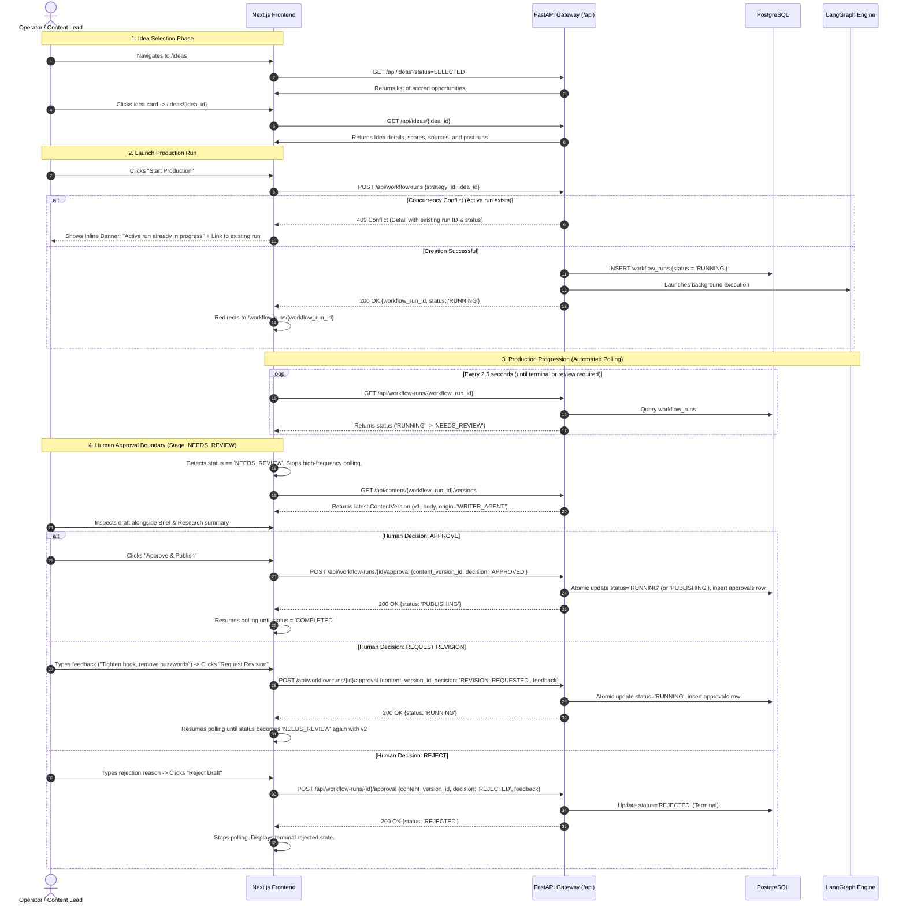
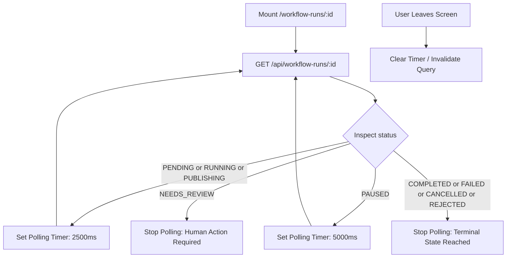

# Content Operating System — Frontend Information Architecture & UX Design (V0)

---

## 1. Information Architecture & Navigation Tree

The Content Operating System (Content OS) frontend is designed as a focused, workflow-driven single-page application built on Next.js, React, and Tailwind CSS. In accordance with `PRD.md` and `ARCHITECTURE.md`, the UI interacts strictly with the FastAPI HTTP gateway under `/api` and has no direct database or internal LangGraph awareness.

### 1.1 Full Site Map / Navigation Tree

```text
App Root (Shell Layout: Top Navigation + Breadcrumb Header + Contextual Action Bar)
│
├── / (Dashboard)
│   ├── Quick Metric Counters (Ideas Discovered, Active Production Runs, Awaiting Approval)
│   ├── Action Required Queue (Runs with status = NEEDS_REVIEW)
│   ├── Active Production Pipeline (Runs with status = PENDING | RUNNING | PAUSED | PUBLISHING)
│   └── Top Scored Ideas Feed (Ideas with status = SELECTED | NEW ready for production)
│
├── /ideas (Discovery & Idea Catalog)
│   ├── Filter & Sort Toolbar (Score range, IdeaStatus filter, Strategy selector)
│   ├── Idea Card Grid / Table View
│   └── /ideas/[id] (Idea Detail & Production Launchpad)
│       ├── Opportunity Overview & 5 Scoring Dimensions
│       ├── Supporting Provenance (Linked Source Items via idea_source_items)
│       ├── Production History (Prior runs: COMPLETED, FAILED, CANCELLED, REJECTED)
│       └── Primary Action: "Start Production Run" (Triggers POST /api/workflow-runs)
│
├── /workflow-runs/[id] (Production Execution Workspace)
│   ├── Workflow Header (Run ID, Strategy Name, Idea Title, Status Badge, Duration)
│   ├── Workflow Stage Progress Bar (Research → Brief → Writer → Approval → Publish → Analytics)
│   ├── Stage Panels:
│   │   ├── Stage 1: Research Artifact Viewer (Summary, Key Findings, Sources, is_stub flag)
│   │   ├── Stage 2: Content Brief Viewer (Target Audience, Angle, Hook, Structure, CTA)
│   │   └── Stage 3: Draft Review & Approval Console (Primary Human-In-The-Loop Boundary)
│   │       ├── Version Switcher (v1, v2, v3... with origin badges: WRITER_AGENT vs HUMAN_EDIT)
│   │       ├── Diff / Content Preview (Markdown / Rich Text)
│   │       ├── Context Drawer (Collapsible Brief & Research Summary)
│   │       └── Decision Console (Approve, Request Revision, Reject)
│   ├── Error Banner (Displayed when status = FAILED, displays workflow_runs.error)
│   └── Cancellation / Abort Modal
│
├── /strategies (Strategy Management — Secondary / Lighter-weight)
│   ├── Strategy List & Enabled Status Toggles
│   └── Strategy Detail / Form (Audience, goals, topics, tone, platform rules)
│
├── /sources (Source Configuration — Secondary / Lighter-weight)
│   ├── Monitored Sources List (RSS, YouTube, Reddit, Web)
│   ├── Manual Sync Trigger ("Sync Now" per source)
│   └── Source Ingestion Log
│
├── /publications (Publications & Distribution — Secondary / Lighter-weight)
│   ├── Published Items List (Platform, Published URL, Idempotency Key, Status)
│   └── Publication Detail & Retry Console
│
└── /analytics (Performance Dashboard — Secondary / Lighter-weight)
    ├── Publication Metrics Table (Views, reads, engagement per publication)
    └── Historical Snapshots View
```

---

## 2. Core User Flows

The fundamental operating loop of Content OS is:
$$\text{Browse Ideas} \longrightarrow \text{Inspect Idea} \longrightarrow \text{Launch Workflow Run} \longrightarrow \text{Observe Progression} \longrightarrow \text{Review & Approve Draft} \longrightarrow \text{Publish}$$

Every step maps directly to the actual PostgreSQL and domain states implemented in the codebase:
- `IdeaStatus`: `NEW`, `SELECTED`, `IN_PROGRESS`, `PUBLISHED`, `REJECTED`, `EXPIRED`
- `WorkflowRunStatus`:
  - Active (non-terminal): `PENDING`, `RUNNING`, `PAUSED`, `NEEDS_REVIEW`, `PUBLISHING`
  - Terminal: `COMPLETED`, `FAILED`, `CANCELLED`, `REJECTED`
- `ContentVersionOrigin`: `WRITER_AGENT`, `HUMAN_EDIT`
- `ApprovalStatus`: `APPROVED`, `REVISION_REQUESTED`, `REJECTED`

### Flow Walkthrough



---

## 3. Screen-by-Screen Breakdown (Core Loop)

### 3.1 Dashboard (`/`)
- **Purpose**: High-level command center. Surface items requiring human intervention immediately (`NEEDS_REVIEW`), track active background generation, and highlight top vetted ideas ready for production.
- **Data Required**:
  - Counts of ideas in `SELECTED` vs `NEW`.
  - Active runs with `status IN ('PENDING', 'RUNNING', 'PAUSED', 'NEEDS_REVIEW', 'PUBLISHING')`.
  - Approval Queue: list of workflow runs currently sitting in `NEEDS_REVIEW`.
- **User Actions**:
  - Click on any item in "Action Required" queue $\rightarrow$ direct jump to `/workflow-runs/{id}` approval console.
  - Click "Start Production" on any top-ranked idea $\rightarrow$ launches workflow run modal.
  - View system health indicator.
- **Backing API Calls**:
  - `GET /api/workflow-runs?status=NEEDS_REVIEW` *(Required endpoint)*
  - `GET /api/workflow-runs?status_group=active` *(Required endpoint)*
  - `GET /api/ideas?status=SELECTED&limit=5&sort=final_score:desc` *(Required endpoint)*

### 3.2 Ideas Catalog (`/ideas`)
- **Purpose**: Filter, sort, and review scored opportunities gathered during Discovery. Select ideas for production.
- **Data Required**:
  - List of Ideas: `id`, `strategy_id`, `title`, `description`, `status`, `relevance_score`, `trend_score`, `novelty_score`, `audience_fit_score`, `source_quality_score`, `final_score`, `created_at`.
  - Indicator whether an active `WorkflowRun` currently exists for that idea.
- **User Actions**:
  - Filter by `IdeaStatus` (`NEW`, `SELECTED`, `IN_PROGRESS`, `PUBLISHED`, `REJECTED`, `EXPIRED`).
  - Sort by `final_score` (default), recency, or specific scoring dimension.
  - Search by keyword in title/description.
  - Click an idea row/card $\rightarrow$ open `/ideas/{id}`.
- **Backing API Calls**:
  - `GET /api/ideas` *(Required endpoint)*

### 3.3 Idea Detail & Launchpad (`/ideas/[id]`)
- **Purpose**: Full opportunity evaluation and execution initiation. Allows the operator to understand *why* an idea was recommended (provenance and scoring breakdown) before committing resources to run the graph.
- **Data Required**:
  - Complete Idea record: title, description, status, full scoring breakdown (0.000–1.000) and `scoring_metadata`.
  - Linked Source Items via `idea_source_items` (titles, URLs, snippets, external IDs).
  - Associated Strategy details (Name, target audience, goals).
  - Past Workflow Runs history for this idea (prior attempts that failed, were cancelled, or were published).
  - Active run status if one is currently in progress.
- **User Actions**:
  - Primary CTA: **"Start Production Run"** (Active when no active run exists).
  - Secondary CTA: **"View Active Run"** (Appears if an active run exists; disables the "Start" button).
  - Mark idea status as `REJECTED` or `SELECTED`.
- **Backing API Calls**:
  - `GET /api/ideas/{id}` *(Required endpoint)*
  - `GET /api/ideas/{id}/sources` *(Required endpoint)*
  - `GET /api/workflow-runs?idea_id={id}` *(Required endpoint)*
  - `POST /api/workflow-runs` with body `{"strategy_id": "...", "idea_id": "..."}` **(Exists in backend)**

### 3.4 Production Execution Workspace (`/workflow-runs/[id]`)
- **Purpose**: The primary mission-control screen for a single production run. Visualizes step-by-step progress through the LangGraph pipeline, displays generated artifacts (Research, Brief, Drafts), and hosts the human approval console.
- **Data Required**:
  - `WorkflowRun` record: `id`, `strategy_id`, `idea_id`, `status`, `error`, `run_metadata`, `created_at`, `resolved_at`.
  - Associated `Research` record: `summary`, `findings` (including `is_stub`), `sources`.
  - Associated `ContentBrief` record: `brief` JSONB (angle, hook, structure, etc.).
  - `Content` and `ContentVersion` records: version list, active version under review, text body, origin.
- **User Actions**:
  - Stage navigation (Jump between Research, Brief, and Draft).
  - Cancel execution (calls `POST /api/workflow-runs/{id}/cancel`).
  - Retry failed run / node.
  - Human review decisions (Approve, Request Revision, Reject).
- **Backing API Calls**:
  - `GET /api/workflow-runs/{id}` **(Exists in backend)**
  - `GET /api/workflow-runs/{id}/research` *(Required endpoint or expanded on run)*
  - `GET /api/workflow-runs/{id}/brief` *(Required endpoint or expanded on run)*
  - `GET /api/content/{id}` & `GET /api/content-versions/{id}` *(Required endpoints)*
  - `POST /api/workflow-runs/{id}/approval` *(Required endpoint)*

---

## 4. State Handling & Visual System

### 4.1 Visual Representation of Real `WorkflowRunStatus` Values

The backend defines 9 distinct lifecycle statuses in `WorkflowRunStatus`. The UI must visually reflect them unambiguously:

| Status Group | DB Enum Value | Visual Badge Style | Status Icon | Description in UI | Polling Behavior |
| :--- | :--- | :--- | :--- | :--- | :--- |
| **Active** | `PENDING` | Amber outline / pulse | Clock / Spinner | Queued in engine, waiting to initiate | Poll every 2.5s |
| **Active** | `RUNNING` | Blue solid / subtle pulse | Animated spinner | Graph node actively executing in background | Poll every 2.5s |
| **Active** | `PAUSED` | Purple soft fill | Pause circle | Execution paused (awaiting external trigger) | Poll every 5s |
| **Active** | `NEEDS_REVIEW` | Amber bold / highlight border | Alert circle / User | Interrupted at human boundary; awaits operator approval | **Stop polling** (Wait for user action) |
| **Active** | `PUBLISHING` | Indigo solid / animated pulse | Upload cloud | Approved draft being transmitted to platform API | Poll every 2.5s |
| **Terminal** | `COMPLETED` | Green solid | Check circle | Fully executed, published, and recorded | **Stop polling** |
| **Terminal** | `FAILED` | Red solid | X-circle | Execution terminated due to error (displays error box) | **Stop polling** |
| **Terminal** | `CANCELLED` | Gray solid | Slash circle | Operator intentionally cancelled run | **Stop polling** |
| **Terminal** | `REJECTED` | Zinc / Slate solid | Thumbs down | Human reviewer explicitly rejected content | **Stop polling** |

### 4.2 Handling 409 Conflict from `POST /api/workflow-runs`

When an operator triggers `POST /api/workflow-runs` but an active run already exists, the backend returns:
- **HTTP Status**: `409 Conflict`
- **Response Body**:
  ```json
  {
    "detail": "An active workflow run (e41e45f8-23da-49a8-b6a7-b76afc512fdf) already exists for idea 3d7d6943-a431-4bd5-af15-9991c85ebad9 with status 'RUNNING'."
  }
  ```

#### UI Reaction:
1. **Never show a generic "Something went wrong" toast.**
2. Parse the UUID and status from `detail`.
3. Display a dedicated non-blocking **Conflict Notification Card** directly above the "Start Production Run" button:
   ```text
   ┌─────────────────────────────────────────────────────────────────────────────┐
   │ ⚠️ Production Run Already Active                                            │
   │ An active workflow run is currently in progress for this idea.             │
   │ Run ID: e41e45f8-23da...  •  Status: RUNNING                               │
   │ [ View Active Run Workspace → ]       [ Dismiss ]                          │
   └─────────────────────────────────────────────────────────────────────────────┘
   ```
4. The button "View Active Run Workspace" navigates directly to `/workflow-runs/e41e45f8-23da-49a8-b6a7-b76afc512fdf`.
5. The local form state resets the "Starting..." button spinner back to enabled.

### 4.3 Loading, Empty, and Error States

- **Loading State (Skeleton Screens)**:
  - Table and detail pages use pulse-animated layout skeletons matching exact card and row geometries to prevent Cumulative Layout Shift (CLS).
  - Graph timeline shows placeholder stage dots connecting greyed-out nodes.
- **Empty State**:
  - `Ideas List Empty`: "No ideas discovered yet. Configure and sync information sources in Settings/Sources to populate opportunities." + Primary button `[ Go to Sources ]`.
  - `Approval Queue Empty`: "All caught up! No content drafts currently require review." + Subtitle `Browse selected ideas to start a new production run.`
- **Error States**:
  - **Network / Gateway Disconnect (502 / 503 / Network Error)**: Toast alert with auto-retry countdown: "Connection lost to FastAPI gateway. Retrying in 5s... [ Retry Now ]".
  - **Workflow Run Failure (`status = 'FAILED'`)**: Persistent red callout box rendered in the workspace header containing:
    - Failure timestamp (`resolved_at`).
    - Exact error message extracted from `workflow_runs.error` (e.g. `Research node failed: ProviderTimeoutError`).
    - Callout indicating whether the failure occurred before or after checkpoint creation.
    - Action button: `[ Retry Failed Stage ]` (when resume endpoint is added) or `[ Start Fresh Run ]`.

---

## 5. Polling Strategy & BackgroundTasks Durability

The current backend uses FastAPI `BackgroundTasks` to execute the LangGraph pipeline asynchronously without WebSockets or Server-Sent Events (SSE).

### 5.1 Polling Policy



1. **Active Execution (`PENDING`, `RUNNING`, `PUBLISHING`)**:
   - Polling interval: **2.5 seconds** (`2500ms`).
   - If consecutive poll count exceeds 48 (2 minutes) without any state or artifact change, render an auxiliary badge: *"Execution taking longer than usual..."*.
2. **Review State (`NEEDS_REVIEW`)**:
   - Polling is **halted immediately**. The human reviewer now controls progression.
   - Fetching latest content drafts is triggered once upon entering this state.
3. **Terminal States (`COMPLETED`, `FAILED`, `CANCELLED`, `REJECTED`)**:
   - Polling is **permanently stopped**. The React Query / SWR query is marked immutable (`staleTime: Infinity`).
4. **Window Inactive / Background Tab**:
   - Polling backs off to **15 seconds** when the browser tab is hidden (`document.visibilityState === 'hidden'`) to conserve client CPU and backend database connection pool capacity.

### 5.2 Acknowledged V0 Failure Mode: The "Silent Process Crash"
- **The Issue**: Because `BackgroundTasks` runs in-process memory on FastAPI, a server restart or container crash while a run is marked `RUNNING` terminates execution without updating PostgreSQL.
- **UX Manifestation**: If unhandled, the frontend polling loop would poll `GET /api/workflow-runs/{id}` indefinitely, showing a perpetually spinning `RUNNING` status.
- **V0 Mitigation in UI**:
  - The client calculates elapsed duration: `Date.now() - new Date(run.created_at).getTime()`.
  - If `status === 'RUNNING'` and elapsed time exceeds **5 minutes** without a heartbeat update in `run_metadata`, the UI displays a warning banner:
    > **⚠️ Execution Appears Stalled**
    > This run has been in `RUNNING` status for over 5 minutes. The backend process may have restarted.
    > `[ Check Server Health ]` `[ Mark as Cancelled / Rerun ]`

---

## 6. Human Approval Interface Design

The Human Approval interface at `status = 'NEEDS_REVIEW'` is the central human-in-the-loop checkpoint in Content OS.

### 6.1 Layout Wireframe

```text
┌────────────────────────────────────────────────────────────────────────────────────────────────────────┐
│  Workflow Run: #e628797e  •  Idea: LangGraph Durable Checkpointing  •  [ NEEDS_REVIEW ]                 │
├────────────────────────────────────────────────────────┬───────────────────────────────────────────────┤
│  LEFT PANE: Context & Evidence (35% Width)             │  RIGHT PANE: Draft & Decision (65% Width)     │
├────────────────────────────────────────────────────────┼───────────────────────────────────────────────┤
│  [ Tabs: Content Brief | Research Evidence | Strategy] │  Draft Header:                                │
│                                                        │  Version: [ v1 (Writer AI) ▼ ]  Origin: Agent │
│  ── Content Brief ──                                   │  Word Count: 1,420 words  •  Platform: Blog   │
│  Angle: Operational resilience with PostgresSaver      ├───────────────────────────────────────────────┤
│  Target Audience: Backend engineers & AI architects    │  Title:                                       │
│  Key Hook: "Why in-memory checkpointers fail in prod"  │  # Building Resilient AI Workflows with       │
│  Structure:                                            │    PostgreSQL Checkpointing                   │
│   • The crash-recovery dilemma                         │                                               │
│   • Step-by-step state recovery                        │  Body:                                        │
│   • Benchmarks and verification                        │  Autonomous workflows are only as dependable  │
│                                                        │  as their durable persistence layer...        │
│  ── Research Findings (Stub Verified) ──               │                                               │
│  ⚠️ [ STUB DATA - Synthetic Analysis ]                 │  [ Inline Diff Toggle: Show Changes from v0 ] │
│  Confidence Score: 85%                                 │                                               │
│  • Growing adoption of durable checkpoint patterns     ├───────────────────────────────────────────────┤
│  • Reduced cycle time with structured pipelines        │  DECISION CONSOLE:                            │
│  Sources:                                              │  ┌──────────────────────────────────────────┐ │
│   1. Industry Analysis: LangGraph Patterns (link)      │  │ Reviewer Feedback / Revision Notes:      │ │
│                                                        │  │ "Sharpen the introduction and highlight  │ │
│                                                        │  │  the atomic 409 handling explicitly."    │ │
│                                                        │  └──────────────────────────────────────────┘ │
│                                                        │  [ ❌ Reject ]  [ 🔄 Request Revision ]      │
│                                                        │  [ ✅ Approve & Publish Content ]             │
└────────────────────────────────────────────────────────┴───────────────────────────────────────────────┘
```

### 6.2 Decision Actions & Execution Semantics

Every approval action locks to the explicit `content_version_id` currently displayed in the UI to prevent stale version approval (the "two tabs" concurrency bug).

#### Action 1: Approve & Publish
- **User Action**: Clicks `[ ✅ Approve & Publish Content ]`.
- **Payload**:
  ```json
  POST /api/workflow-runs/{id}/approval
  {
    "content_version_id": "9a12c842-...",
    "decision": "APPROVED",
    "feedback": "Approved for publication."
  }
  ```
- **UI State During Request**:
  - Buttons disabled. The Approve button changes to `[ Approving & Queuing Publication... (spinner) ]`.
- **UI State on 200 OK**:
  - Immediate transition of status indicator to `PUBLISHING`.
  - Re-activates background polling loop to watch for `COMPLETED`.
- **UI State on 409 Conflict**:
  - Modal prompt: *"Stale Version Error: A newer draft version was generated while you were reviewing. Please refresh to inspect the latest content."*

#### Action 2: Request Revision
- **User Action**: Enters required instructions in the Feedback textarea $\rightarrow$ clicks `[ 🔄 Request Revision ]`.
- **Payload**:
  ```json
  POST /api/workflow-runs/{id}/approval
  {
    "content_version_id": "9a12c842-...",
    "decision": "REVISION_REQUESTED",
    "feedback": "Tighten section 2 and add code snippet."
  }
  ```
- **UI State During Request**:
  - Buttons disabled, feedback box set to read-only.
- **UI State on 200 OK**:
  - Status badge updates to `RUNNING`.
  - Stage indicator moves backward to `Writer (Revising)`.
  - Polling loop starts; waits until writer finishes and status returns to `NEEDS_REVIEW` with an incremented version number (`v2`).

#### Action 3: Reject Content
- **User Action**: Clicks `[ ❌ Reject ]`.
- **Confirmation Dialog**: Modal prompt: *"Are you sure you want to reject this run? This will permanently end workflow execution for this attempt."*
- **Payload**:
  ```json
  POST /api/workflow-runs/{id}/approval
  {
    "content_version_id": "9a12c842-...",
    "decision": "REJECTED",
    "feedback": "Topic no longer relevant."
  }
  ```
- **UI State on 200 OK**:
  - Status permanently updates to `REJECTED`. All editor and action panels lock into read-only mode.

---

## 7. Component Hierarchy

```text
src/
├── components/
│   ├── layout/
│   │   ├── AppShell              # Main responsive frame, sidebar, topbar
│   │   ├── NavigationHeader      # Logo, global breadcrumbs, environment pill
│   │   └── GlobalHealthIndicator # Live indicator based on /health & /health/db
│   │
│   ├── shared/
│   │   ├── StatusBadge           # Universal badge supporting all 9 WorkflowRunStatus enums
│   │   ├── ScoreMeter            # Radial/progress display for 0.000-1.000 scoring values
│   │   ├── ConflictBanner        # Standardized 409 error banner with direct run link
│   │   ├── EmptyStateDisplay     # Configurable icon, heading, body, and CTA action
│   │   ├── ErrorCallout          # Formatted display of backend error strings
│   │   └── PollingIndicator      # Subtle radar animation indicating active background poll
│   │
│   ├── ideas/
│   │   ├── IdeaCard              # Card layout for ideas with scores and status tags
│   │   ├── IdeaTable             # Tabular layout with column sorting
│   │   ├── ScoringBreakdownPanel # Visual display of all 5 scores + weighted final
│   │   ├── SourceProvenanceList  # List of supporting source items with URLs
│   │   └── StartRunButton        # Primary action button with loading and 409 handling
│   │
│   ├── workflow/
│   │   ├── WorkflowTimeline      # Linear step progress bar (Research -> Brief -> Writer -> Approval)
│   │   ├── ResearchArtifactView  # Formatted view of findings, claims, and stub warning
│   │   ├── BriefArtifactView     # Structured view of angles, audience, hook, and CTA
│   │   ├── StalledRunWarning     # Warning triggered when RUNNING exceeds threshold
│   │   └── RunHistoryTable       # List of prior workflow attempts for a given idea
│   │
│   └── approval/
│       ├── ApprovalConsole       # Container layout for the approval screen
│       ├── VersionSelector       # Dropdown showing v1, v2 with author origin badges
│       ├── DraftViewer           # Markdown/formatted reader with typography styles
│       ├── ContextDrawer         # Tabbed side drawer with Brief & Research reference
│       └── DecisionActionBar     # Sticky bottom bar with Approve/Revision/Reject actions
```

---

## 8. Frontend State Management

To maintain architectural cleanliness, state is strictly split between **Server State** and **Local UI State**:

### 8.1 Server State (TanStack React Query / SWR)
All data that represents durable PostgreSQL database records belongs in React Query cache:
- **`useWorkflowRun(runId)`**:
  - Handles the polling loop based on `status`.
  - Configured with `refetchInterval: (data) => isActiveStatus(data?.status) ? 2500 : false`.
- **`useIdea(ideaId)`**: Cached idea details and source provenance.
- **`useIdeas(filter, sort)`**: Cached catalog of content ideas.
- **`useContentVersions(runId)`**: Immutable content draft version history.
- **`useAppHealth()`**: Polled every 30 seconds against `/health` and `/health/db`.

### 8.2 Local UI State (React `useState` / URL Search Params)
All ephemeral, client-only interactions:
- Filter criteria in the Ideas list (`?status=SELECTED&sort=score`) $\rightarrow$ synced to URL search parameters for link shareability.
- Revision feedback draft text in the approval textarea before submission.
- Active tab selection in the Context Drawer (`brief` vs `research`).
- Diff toggle state (Compare v2 to v1).
- Confirmation modal visibility flags (`isRejectModalOpen`).

---

## 9. Secondary Screens (V0 Lighter Treatment)

### 9.1 Content Strategies (`/strategies`)
- **Purpose**: View and toggle content production goals, audience definitions, and voice rules.
- **Layout**: Simple 2-column layout: Left column displays list of strategies with active status toggles (`enabled: true/false`); right column displays a read/edit card showing JSONB `config` elements (Target audience, platforms, content types, tone guidelines).
- **V0 Scope**: Basic viewing and active toggle; comprehensive multi-strategy matrix editing is deferred.

### 9.2 Monitored Sources (`/sources`)
- **Purpose**: Manage ingestion feeds (RSS, YouTube channels, Reddit communities, Websites).
- **Layout**: Table view displaying Source Name, Type Badge (`rss`, `youtube`, etc.), Configured URL, Last Sync timestamp, and a manual **"Sync Now"** action button.
- **V0 Scope**: View configured sources and trigger on-demand sync; scheduled recurring cron management is deferred.

### 9.3 Publications (`/publications`)
- **Purpose**: Registry of pieces that have completed the workflow and reached external platforms.
- **Layout**: Filterable table showing Content Title, Target Platform (`medium`, `substack`), Published Timestamp, External Link, and Idempotency Key.
- **V0 Scope**: Read-only log of successful and failed publications with copyable external URLs.

### 9.4 Analytics (`/analytics`)
- **Purpose**: Review post-publication engagement performance.
- **Layout**: Basic list of published pieces with key metrics extracted from `analytics.metrics` (Views, Reads, Upvotes/Likes, Shares).
- **V0 Scope**: Tabular display of the latest analytics snapshot; interactive time-series charting is deferred.

---

## 10. API-to-UI Mapping Table

This table maps every screen in the information architecture to the backing backend API endpoints, identifying which endpoints exist today versus those that must be developed next.

| Screen / Flow | Action / Query | Method & Path | Status in Codebase | Notes / Response Shape |
| :--- | :--- | :--- | :--- | :--- |
| **Global / Shell** | Backend Health Check | `GET /health` | **Exists** | `{"status": "ok"}` |
| **Global / Shell** | Database Connection Check | `GET /health/db` | **Exists** | `{"status": "ok", "db_result": 1}` |
| **Dashboard** | Fetch Approval Queue | `GET /api/workflow-runs?status=NEEDS_REVIEW` | **Missing** | Returns list of runs awaiting review |
| **Dashboard** | Fetch Top Scored Ideas | `GET /api/ideas?status=SELECTED&limit=5` | **Missing** | Returns top opportunities |
| **Ideas Catalog** | List & Filter Ideas | `GET /api/ideas` | **Missing** | Supports filtering by status, sorting by score |
| **Idea Detail** | Fetch Single Idea | `GET /api/ideas/{id}` | **Missing** | Returns title, description, scores, metadata |
| **Idea Detail** | Fetch Supporting Sources | `GET /api/ideas/{id}/sources` | **Missing** | Returns items linked via `idea_source_items` |
| **Idea Detail** | **Start Production Run** | `POST /api/workflow-runs` | **Exists** | Accepts `strategy_id`, `idea_id`. Returns 200 or 409 |
| **Workflow Run** | **Fetch Run Status** | `GET /api/workflow-runs/{id}` | **Exists** | Returns `workflow_run_id`, `status`, `error` |
| **Workflow Run** | **Fetch Research Artifact** | `GET /api/workflow-runs/{id}/research` | **Exists** | Returns `summary`, `findings`, `sources` from DB |
| **Workflow Run** | **Fetch Content Brief** | `GET /api/workflow-runs/{id}/brief` | **Exists** | Returns `brief` JSONB from `content_briefs` |
| **Workflow Run** | Fetch Content Draft & Versions | `GET /api/workflow-runs/{id}/content` | **Missing** | Returns versions list from `content` & `content_versions` |
| **Workflow Run** | Cancel Run Execution | `POST /api/workflow-runs/{id}/cancel` | **Missing** | Updates status to `CANCELLED` |
| **Approval Console** | **Submit Approval Decision** | `POST /api/workflow-runs/{id}/approval` | **Exists** | Accepts `content_version_id`, `decision`, `feedback` |
| **Strategies** | List Strategies | `GET /api/strategies` | **Missing** | Returns list of strategies |
| **Strategies** | Toggle / Update Strategy | `PATCH /api/strategies/{id}` | **Missing** | Updates enabled flag or config |
| **Sources** | List Monitored Sources | `GET /api/sources` | **Missing** | Returns configured sources |
| **Sources** | Trigger Source Sync | `POST /api/sources/{id}/sync` | **Missing** | Triggers ingestion service |
| **Publications** | List Publications | `GET /api/publications` | **Missing** | Returns publication history |
| **Analytics** | View Publication Analytics | `GET /api/publications/{id}/analytics` | **Missing** | Returns latest analytics snapshot |

---

## 11. Explicit V0 vs. Deferred Scope

To prevent scope creep and align with `PRD.md` and `ROADMAP.md`, the UI design explicitly demarcates V0 features from deferred items:

### In Scope for V0 Design
1. **Core Review Loop**: Full UX for Idea $\rightarrow$ Workflow Run $\rightarrow$ Approval $\rightarrow$ Publication Status.
2. **Real Status Badging**: Strict representation of the 9 `WorkflowRunStatus` database values.
3. **Robust 409 Conflict Handling**: Contextual UI banner preventing duplicate active runs with direct linking to in-progress runs.
4. **Draft Approval Console**: High-priority dual-pane review layout with Brief/Research context and Version origin badges (`WRITER_AGENT` vs `HUMAN_EDIT`).
5. **Research Stub Identification**: Prominent visual flag for `"is_stub": true` data in the research artifact viewer.
6. **Graceful Polling Management**: Dynamic polling with termination upon `NEEDS_REVIEW`, `COMPLETED`, `FAILED`, or `REJECTED`.

### Explicitly Deferred (Post-V0)
1. **Real-time WebSockets / SSE**: Push updates are deferred; V0 relies strictly on client-side HTTP polling.
2. **Multi-Platform Distribution Selectors**: V0 assumes one platform target per workflow run; multi-platform broadcasting UI is deferred.
3. **Visual Media & Image Generation**: Text-first content only; media asset generation or preview tools are deferred.
4. **Interactive Analytics Charting**: Time-series graphs and trend analysis are deferred; simple metric cards are used.
5. **Multi-Tenancy & Workspace Switcher**: Single-tenant creator workflow; orgs, roles, and teams are deferred.
6. **In-Browser Collaborative Draft Editing**: Real-time multi-user Google Docs-style editing is deferred; simple versioned submissions are used.
