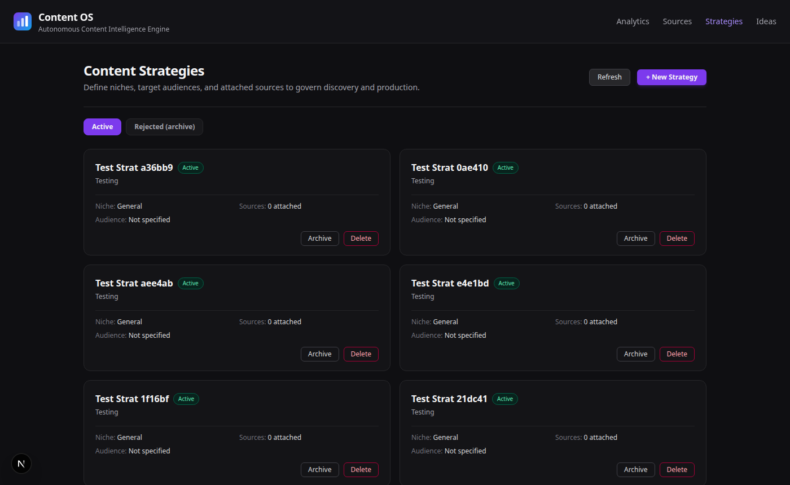
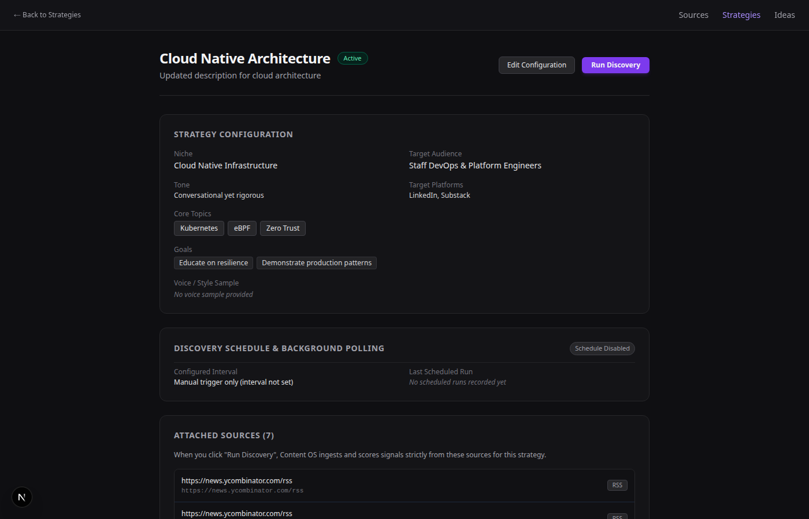

# Content OS: Progress

Status as of **6 October 2026**. Verified items are marked by the check that proved them. Anything not verified is marked as such.

Companion documents: [PROJECT_DOCUMENTATION.md](PROJECT_DOCUMENTATION.md) (how the system works), [../STARTUP.md](../STARTUP.md) (how to run it), [../DECISIONS.md](../DECISIONS.md) (why).

---

## 1. Summary

| Area | State |
|---|---|
| Discovery (sources, scouting, scoring, ideas) | Working. RSS only. Duplicate ideas still exist (see §5). |
| Production workflow (research, writer, approval, revision, reject) | Working. Runs are durable: they survive a backend restart. Needs the worker running. |
| Publishing to LinkedIn through Buffer | Working for text. Images attach only when a public HTTPS image URL is configured. |
| Analytics (Buffer polling, snapshots, status, dashboard) | Working. LinkedIn only. Polling daily for 30 days after the backoff ladder. |
| Frontend (Ideas board, Strategies, Sources, Analytics, Run page, Settings) | Working. One shared theme. Login screen gates the whole app. |
| Accounts and login | Email and password working. Google needs your OAuth credentials. Supabase not configured. Per-account data and keys. |
| Image generation | Local test provider only (labelled as a stub). Real image models need OpenRouter credit. |
| Other platforms (Facebook, Instagram, Reddit, Substack) | Listed, not connected. No publishing or analytics. |

---

## 2. Roadmap status

`ROADMAP.md` still has its original unchecked boxes. This is the real state of each phase.

| Phase | Status | Notes |
|---|---|---|
| 0 Foundation | Done | |
| 1 Persistence | Done | Alembic head `c9d3a1f0e2b7`. Partial unique indexes enforce one active run per idea and one NEW idea per title per strategy. |
| 2 Discovery | Done for RSS | Source sync, normalisation, dedupe, scouting, scoring, human selection. Re-proposed ideas are now skipped. |
| 3 Production workflow | Done | LangGraph with PostgresSaver. Runs queued as durable jobs (ADR-022). |
| 4 Publishing | Done for LinkedIn | Idempotent by key. Image attachment wired, not yet posted live (needs a public host, §5). |
| 5 Analytics | Done for LinkedIn | Snapshots, status, cross-post dashboard, platform tabs, historical trend chart. |
| 6 Frontend | Largely done | Dashboard is the Ideas board. Analytics dashboard exists. No separate home dashboard. |
| Future | Not started | Semantic dedupe, performance insights, scheduling of posts, more platforms. |

---

## 3. What was built, by milestone

Commits are on local `main`. 54 were not pushed at the time of writing; the user pushes manually.

### Discovery and ideas
- Sources: RSS feeds. A source is named after its link unless a name is typed. Existing sources renamed to their link (52 rows, before-values recorded).
- Scouting and scoring: one structured LLM call per batch, Python computes the weighted final score.
- Ideas show the strategy they came from and the platforms of that strategy.
- Ideas board: New, Selected, In progress and Published columns, each sorted by score. Archive is a separate tab.
- Archive, restore and permanent delete for ideas and strategies. Delete is refused while a workflow run exists (the run owns drafts, approvals, publications, analytics).
- Discovery skips any title the strategy already proposed.

### Production workflow
- Start and approval queue a `WORKFLOW_RUN` job in the same transaction as the state change. The worker runs the graph. No `BackgroundTasks`.
- A new run is `PENDING` until the worker claims it with a conditional `UPDATE`. A duplicate start job cannot run the same graph twice.
- Long runs renew their claim and heartbeat every 30 s.
- Edit draft: saves a new immutable version (origin `HUMAN_EDIT`) while the run awaits review. The version under review is never changed.
- Writer output is cleaned in code (no `##`, `**`, section labels). Verified on the real draft from run `c3df7d37`: 5 headings and 32 bold markers became none.

Verified end to end on a scratch copy: start → `NEEDS_REVIEW` → REJECTED approval → `REJECTED`, zero publications created.

### Publishing
- Buffer `createPost` with `assets: [{image: {url}}]` when the version has a ready image.
- Buffer has no upload endpoint and fetches the image itself, so the URL must be public HTTPS (`MEDIA_PUBLIC_BASE_URL`). A version with an image and no public URL fails before any write. It is never sent as text only.
- Idempotency key `content_version_id:platform`, unique constraint.

### Analytics
- Snapshots only when Buffer reports a metric other than Reactions/Comments (the placeholder shape). Verified against real responses (fixtures in `backend/tests/fixtures/`).
- Network failures (DNS, timeout, reset) are a separate `network_error` state. They never store a snapshot and never consume a rung of the retry ladder.
- Backoff ladder 15 min → 1 h → 6 h → 24 h → 72 h → 7 d, then one check a day for 30 days after publication.
- A post Buffer reports as not found is marked **deleted upstream**; polling stops. This is inferred from the not-found response for a made-up ID. It has not been seen on a real deleted post.
- Cross-post dashboard with platform tabs and a Show all view. Platforms without a connected channel show "not connected" and no numbers.
- Impressions trend chart on the run page (valid snapshots only).
- Diagnostic: `python -m app.analytics.diagnose` (read-only Buffer queries).

### Health and operations
- `/health`, `/health/db`, `/health/network`.
- Scheduler worker writes a heartbeat; the UI reports whether automatic sync is running.
- Migration `alembic upgrade head` is additive throughout.

### Frontend
- One navigation (`AppNav`) on every page: Analytics, Sources, Strategies, Ideas.
- One theme: colours are tokens in `frontend/src/app/globals.css`; shared component classes (`cos-card`, `cos-btn`, `cos-input`, `cos-header`).
- Platform chips with simplified SVG marks (not official logos).
- Logo: three rising bars on a violet-to-sky tile. Used in headers and as the browser icon.

---

## 4. Verification record

| Check | Result | Evidence |
|---|---|---|
| Backend test modules (19 files) | Pass, on a scratch copy of the database | Run after each change; 0 failures in the final run |
| Frontend build | Pass | `npm run build` |
| Browser checks | Pass for the pages listed in §3 | Playwright runs against the live app |
| `/health/network` | All three hosts resolve | Three calls 10 s apart |
| Live worker heartbeat | Pass | Heartbeat row written; status flips to "not running" after the stale window |
| Start → review → reject on a scratch copy | Pass | §3 Production workflow |
| Secret scan of changed files | 0 hits in the final scan | Pattern scan; **full-history scan found dummy `sk-or-v1-` values in `test_openrouter_failures.py` (20 commits). Not credentials, not rewritten.** |

Not verified:
- A live Buffer post with an image (needs a public host and your confirmation).
- The writer prompt change with a live model (no OpenRouter credit).
- A real deleted LinkedIn post being detected.
- The 12:40 PKT diagnostic re-run (scheduled, see §6).

---

## 5. Known issues

| Issue | Impact | What it needs |
|---|---|---|
| Duplicate ideas already exist (e.g. "Durable State Persistence in LangGraph with PostgreSQL" ×5) | Clutter on the board; each copy has its own runs | Decision: merge, or archive all but one. Archiving is blocked for in-progress ideas. |
| In-progress ideas cannot be deleted or archived | They have runs, and the backend refuses both | Decision: allow delete with run (cascading, with confirmation), or allow archive for in-progress. |
| Image publishing needs a public HTTPS image host | No real image post yet | Choose a host: S3/R2 credentials, or a tunnel exposing only the media folder. |
| Writer prompt change not tested against a live model | Output tone unverified | Needs OpenRouter credit, or a manual draft check. |
| 356 active strategies, most are leftover test data | Strategies page is cluttered | Archive the test ones. |
| Seven scheduler job rows for the real LinkedIn post were deleted by an accidental test run | Post `a95b9eec…` has no sync history; its page says "No metrics checked yet" until the next sync | Not recoverable. Fixed the cause: destructive tests now refuse the dev database. |
| Real LinkedIn posts with raw Markdown | Visible on LinkedIn | Decision: keep or delete (not touched by the app). |
| `PROJECT_BRIEF.md` referenced by task files is not in the repo | Task instructions point to a missing file | Add it to the repo or update the references. |

---

## 6. Open decisions and next steps

1. **Duplicate ideas and in-progress deletion** (§5). Both need your choice.
2. **Public image host** for real image posts. Then one dummy post to LinkedIn, with your confirmation.
3. **Scheduler and worker:** run `python -m app.scheduler` in a terminal. Without it, new runs stay queued and analytics polling does not run.
4. **Diagnostic re-run** for post `6ac3541…` at or after 12:39 PKT on 6 Oct. Then fill in the "does Buffer's dashboard show impressions?" question.
5. **Push** the local commits.
6. **Apply the theme** to the remaining pages (Run detail header, a few one-off colours in the Run page).
7. **Clean up** test strategies and sources.

---

## 7. Changelog (recent, newest first)

| Commit | Change |
|---|---|
| `7f3f867` | One shared navigation; Delete beside Archive |
| `799ac2e` | One shared theme (tokens and component classes) |
| `eca5cac` | Ideas stage board (option D); logo |
| `d37b830` | Strategy page lists its ideas; idea cards show the strategy |
| `3a8af8a` | Strategy name on ideas; filter ideas by strategy |
| `45829b7` | Source title is the link; optional name field |
| `ceb4ddd` | Sources named after their link (52 renamed) |
| `d2837bf` | SVG platform logos; archive views; edit draft; image prompt |
| `dcd33cf` | Archive, restore and delete for ideas and strategies; deleted-upstream marking |
| `adff12d` | Platform tabs on analytics; platform badges on ideas |
| `30787a3` | Platform on each idea; per-platform analytics summary |
| `6f83717` | Daily polling test follows the new rule |
| `091fde0` | Plain-text drafts |
| `599c38f` | Image attachment via public URL |
| `3f4331e` | Cross-post analytics dashboard |
