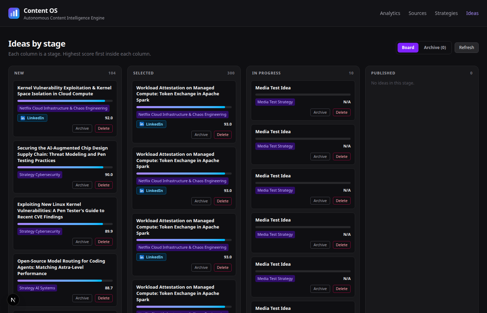
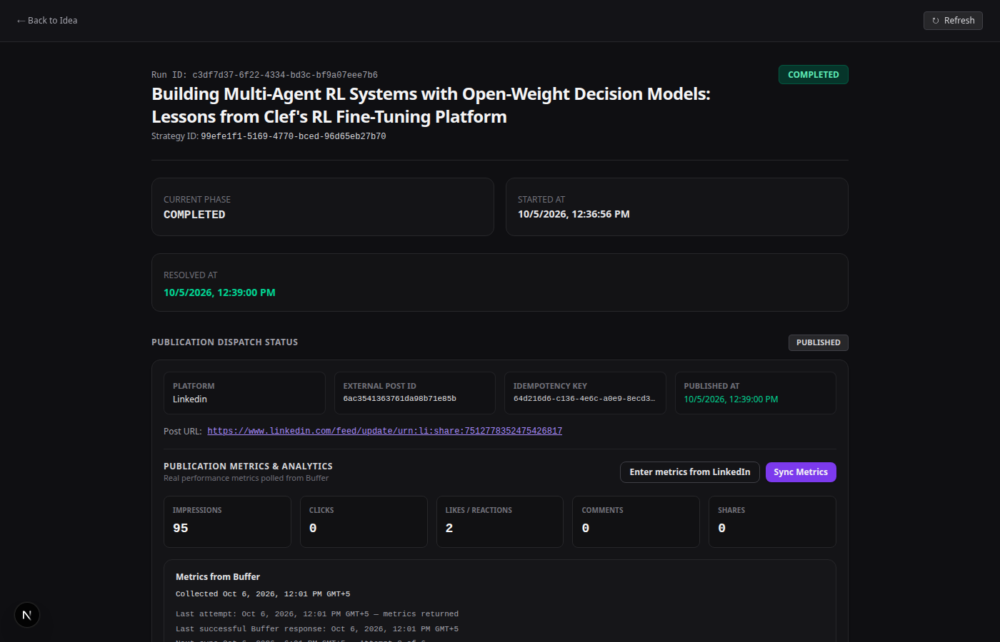
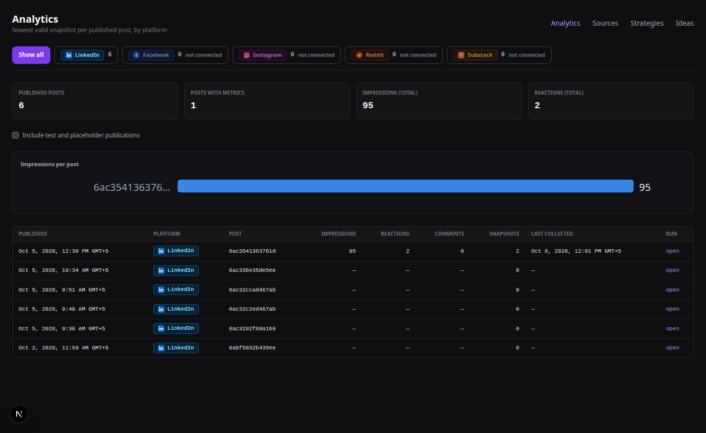
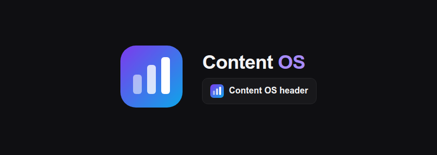

# Content OS: Project Documentation

Content OS discovers content ideas from sources, drafts and reviews posts with a human approving each one, publishes to LinkedIn through Buffer, and measures results.

Status and open decisions: [PROGRESS.md](PROGRESS.md).

---

## 1. The idea in one picture

```
Strategy ─▶ Sources (RSS) ─▶ Scout + score (LLM) ─▶ Ideas ─▶ [you select] ─▶ Workflow run
                                                                              │
                 Analytics ◀── Buffer ◀── Publish ◀── Approval ◀── Writer ◀── Research
```

- **Discovery** runs on a strategy. It creates ideas. It never starts writing or publishing.
- **Production** starts from a selected idea. It runs research, writes a draft, and waits for your approval.
- **Analytics** reads Buffer for posts you published and keeps a history of snapshots.

---

## 2. Screens

| Screen | Route | What you do there |
|---|---|---|
| Ideas | `/ideas` | Board of ideas by stage. Archive, restore, delete. Opens an idea. |
| Idea detail | `/ideas/{id}` | Score breakdown, source provenance, start a production run. |
| Strategies | `/strategies` | Create, archive, restore, delete strategies. |
| Strategy detail | `/strategies/{id}` | Edit configuration, attach sources, run discovery, see its ideas. |
| Sources | `/sources` | Add RSS sources. |
| Run page | `/workflow-runs/{id}` | Review the draft, edit it, approve or request a revision, see media, analytics, publication. |
| Analytics | `/analytics` | Per-platform tabs and a Show all view; impressions chart and table. |
| Settings | `/settings` | Your own API keys (encrypted) and platforms: turn on or off, set the Buffer channel ID, test the connection (read-only). |




---

## 3. Using it, step by step

1. **Create a strategy** (`/strategies` → New Strategy). Name, niche, audience, tone, target platforms, and optionally a voice sample.
2. **Attach sources.** Each source is named after its link unless you type a name.
3. **Run discovery** on the strategy. Ideas appear on the Ideas board, and at the bottom of the strategy page.
4. **Pick an idea** and start a production run. The run is queued; the worker starts it.
5. **Review the draft** on the run page. Edit it if needed (saves a new version). Generate or edit the image prompt.
6. **Approve, request a revision, or reject.** Approval queues the publish.
7. **Watch analytics** on the run page and on `/analytics`.

> The worker must be running for queued work to start: `python -m app.scheduler` (see [../STARTUP.md](../STARTUP.md)).

---

## 4. Lifecycle rules

These rules are enforced by the database or the backend, not only by the UI.

### Ideas
| Action | Allowed from | Effect |
|---|---|---|
| Archive | NEW, SELECTED | Status → REJECTED. Reversible. |
| Restore | REJECTED | Status → NEW. Refused if a NEW copy with the same title exists. |
| Delete permanently | any status with **no** workflow runs | Removed. Refused otherwise (the message says to archive). |

Only one NEW idea may exist per title per strategy. Discovery skips titles the strategy already has.

### Strategies
| Action | Effect |
|---|---|
| Archive / restore | `archived_at` set or cleared. Reversible. |
| Delete permanently | Refused while any idea of the strategy has a workflow run. |

### Workflow runs
- One active run per idea (database index).
- A run waits in `PENDING` until the worker claims it.
- Drafts can be edited only while the run is `NEEDS_REVIEW`. Each edit is a new version; old versions are never changed.

### Publishing
- Idempotency key `content_version_id:platform`, unique.
- An image is attached only when `MEDIA_PUBLIC_BASE_URL` is a public HTTPS address. Otherwise publishing stops before anything is written.

---

## 5. Analytics in detail



- **Snapshots** are written only for real metrics. A response that reports only Reactions and Comments at zero is an uncollected placeholder and is not stored.
- **Polling:** 15 min, 1 h, 6 h, 24 h, 72 h, 7 d, then once a day until 30 days after publication.
- **Network failures** (this server cannot reach Buffer) show as "Couldn't reach Buffer from this server". They are not counted as attempts.
- **Deleted on the platform:** when Buffer says the post is not found, the post is marked "Deleted on LinkedIn" and polling stops.
- **Status line:** one state per post, taken from the most recent attempt (scheduled or manual click).
- **Platforms:** LinkedIn is connected. Facebook, Instagram, Reddit and Substack are listed as not connected; they show no numbers.

Diagnostic (read-only, needs network):

```bash
cd backend && ../.venv/bin/python -m app.analytics.diagnose
```

---

## 6. Architecture

```
Next.js (frontend)  ──HTTP──▶  FastAPI (backend/app)  ──▶  PostgreSQL 18 (project-local)
                                   │                          ▲
                                   ├─▶ LangGraph (production) ─┤  checkpoints in PostgresSaver tables
                                   ├─▶ Scheduler worker ───────┘  scheduled_jobs, worker_heartbeats
                                   ├─▶ OpenRouter (LLM)
                                   └─▶ Buffer (publish + analytics)
```

Backend layout (`backend/app/`):

| Package | Responsibility |
|---|---|
| `ideas/` | Ideas, scoring, lifecycle (archive, restore, delete) |
| `strategies/` | Strategies, discovery trigger |
| `sources/` | RSS sources, sync, naming |
| `workflows/` | Workflow runs, approval, human edits, writer, draft cleanup |
| `graph/` | LangGraph topology and nodes |
| `content/` | Content and immutable content versions |
| `publishing/` | Publish service, Buffer provider, LinkedIn rendering, platform registry |
| `analytics/` | Buffer analytics, snapshots, status, dashboard, diagnostic, deleted-upstream |
| `scheduler/` | Worker, job claims, leases, heartbeat, analytics schedule |
| `media/` | Image generation (local test provider), storage, public URL |
| `health/` | Network diagnostic |
| `llm/` | OpenRouter client with classified errors |

Frontend layout (`frontend/src/`):

| Path | Responsibility |
|---|---|
| `app/globals.css` | **The theme:** colour tokens and shared component classes |
| `components/AppNav.tsx` | The one navigation |
| `components/PlatformBadge.tsx` | Platform chips with SVG marks |
| `lib/api.ts` | All calls to the backend |
| `app/<page>/page.tsx` | One folder per screen |

Reference documents (kept current in the repo):
- [../ARCHITECTURE.md](../ARCHITECTURE.md), [../DATABASE.md](../DATABASE.md), [../WORKFLOW.md](../WORKFLOW.md)
- [../API.md](../API.md): endpoints and response fields
- [../FRONTEND_IA.md](../FRONTEND_IA.md): screen design
- [../DECISIONS.md](../DECISIONS.md): decision records (ADR-001 to ADR-022)
- [../STARTUP.md](../STARTUP.md): how to start and stop everything

---

## 7. API (summary)

The full reference is in [../API.md](../API.md). The routes:

| Group | Routes |
|---|---|
| Health | `GET /health`, `GET /health/db`, `GET /health/network` |
| Ideas | `GET /api/ideas` (filters: `status`, `strategy_id`, `limit` ≤ 500), `GET /api/ideas/{id}`, `GET /api/ideas/{id}/sources`, `POST /api/ideas/{id}/archive`, `POST /api/ideas/{id}/restore`, `DELETE /api/ideas/{id}` |
| Strategies | `GET/POST /api/strategies` (`archived=`), `GET/PATCH/DELETE /api/strategies/{id}`, `POST /api/strategies/{id}/archive`, `POST /api/strategies/{id}/restore`, `POST /api/strategies/{id}/discover` |
| Sources | `GET/POST /api/sources`, `GET/PATCH /api/sources/{id}`, `POST /api/sources/{id}/sync` |
| Workflow runs | `GET/POST /api/workflow-runs`, `GET /api/workflow-runs/{id}`, `POST /api/workflow-runs/{id}/approval`, `GET .../research`, `.../brief`, `.../draft`, `POST .../draft/versions`, `GET .../publication` |
| Media | `GET/POST /api/content/{content_id}/versions/{version_id}/media`, `GET /api/media/files/{filename}` |
| Publications | `GET /api/publications/{id}`, `GET /api/publications/{id}/analytics`, `POST .../analytics/sync`, `POST .../analytics/manual` |
| Analytics | `GET /api/analytics/summary` (`platform=`, `include_test=`) |
| Settings | `GET /api/settings/platforms`, `PUT /api/settings/platforms/{key}`, `POST /api/settings/platforms/{key}/test` (read-only) |

---

## 8. Data

PostgreSQL 18, one project-local cluster (`.pgdata`, socket in `.pgsockets`). Migrations are Alembic; the head revision is `c9d3a1f0e2b7`. Key constraints:

- One active workflow run per idea (partial unique index).
- One NEW idea per title per strategy (partial unique index).
- `publications.idempotency_key` unique.
- `content_versions (content_id, version_number)` unique; versions are never updated.
- Analytics rows are append-only snapshots. Quarantined rows are flagged, not deleted.

Real data is not deleted by tests. Destructive test suites refuse to run against the dev database (`backend/tests/_db_guard.py`).

---

## 9. Running and testing

Start order and commands: [../STARTUP.md](../STARTUP.md).

```bash
# Backend tests (rolled-back transactions, or a scratch database)
cd backend && PYTHONPATH=. ../.venv/bin/python -m unittest tests.test_idea_strategy_lifecycle

# Frontend build (types and JSX)
cd frontend && npm run build

# Browser checks
cd frontend && ../.venv/bin/python tests/e2e/test_analytics_ui_states.py
```

Test modules: 19 files under `backend/tests/`. Browser suites under `frontend/tests/e2e/`.

---

## 10. Theme and visual design



- Palette: canvas `#0f0f12`, panel `#18181b`, raised `#27272a`, accent violet `#7c3aed`, text levels from `#f4f4f5` down to `#52525b`.
- Change colours in one place: `frontend/src/app/globals.css`.
- Chart colour `#3987e5` was validated against the app surface with the dataviz validator.
- Platform marks are simplified SVGs, not official logos.

---

## 11. Conventions

- Every state change is an atomic database operation (conditional `UPDATE` with a row-count check, or a unique constraint).
- No silent fallbacks: a missing provider or missing configuration fails loudly and says so.
- LLM output is data; code decides what is saved, scored and published.
- Commits: `type(scope): summary`, with the attribution line.

---

## 12. Accounts, login and data ownership

Every person who uses an installation has an account. Each account sees only its own data.

- **Sign-in options** on the login screen: email and password (always available), Google (when `GOOGLE_CLIENT_ID` and `GOOGLE_CLIENT_SECRET` are set in `backend/.env`), and Supabase (planned, not configured).
- **Sessions:** the browser cookie has no expiry, so it ends when the browser session ends. The server also expires sessions after 8 hours. Logout ends a session at once.
- **Lockout:** five wrong passwords lock the account for 15 minutes.
- **Ownership:** strategies, sources, ideas, workflow runs, publications and scheduled jobs carry an owner. Drafts, versions, media and analytics belong to their workflow run. Every route checks ownership and answers 404 for another account's data.
- **Keys and platforms are per account:** each account stores its own Buffer and OpenRouter keys (Settings, encrypted). When an account has no key of its own, the installation default in `.env` is used.
- **Public media:** published images are served without login, because Buffer must fetch them.

Set the password for an account from a terminal, so it never appears on a command line:

```bash
cd backend && ../.venv/bin/python -m app.accounts.set_password you@example.com
```
